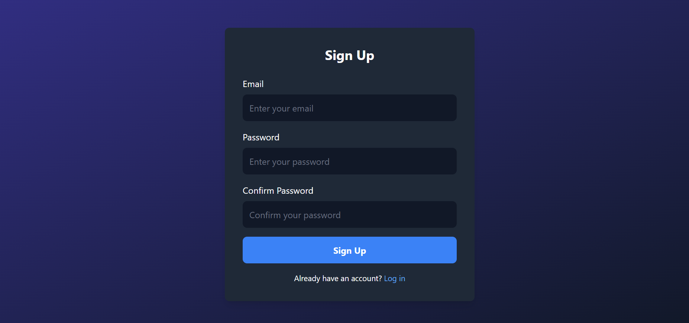
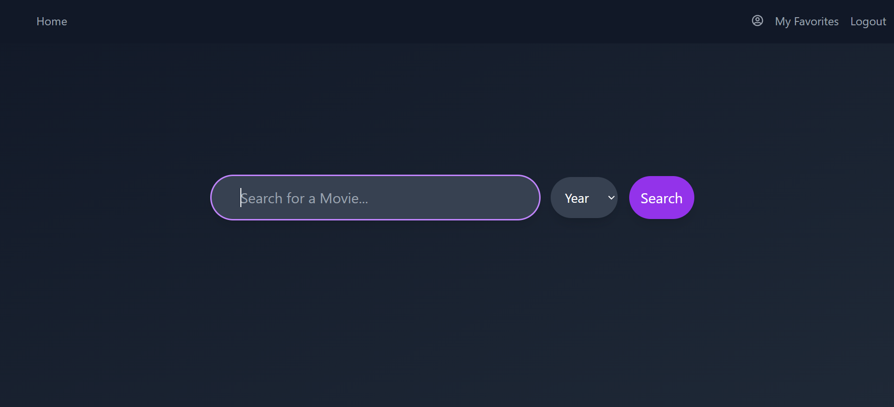
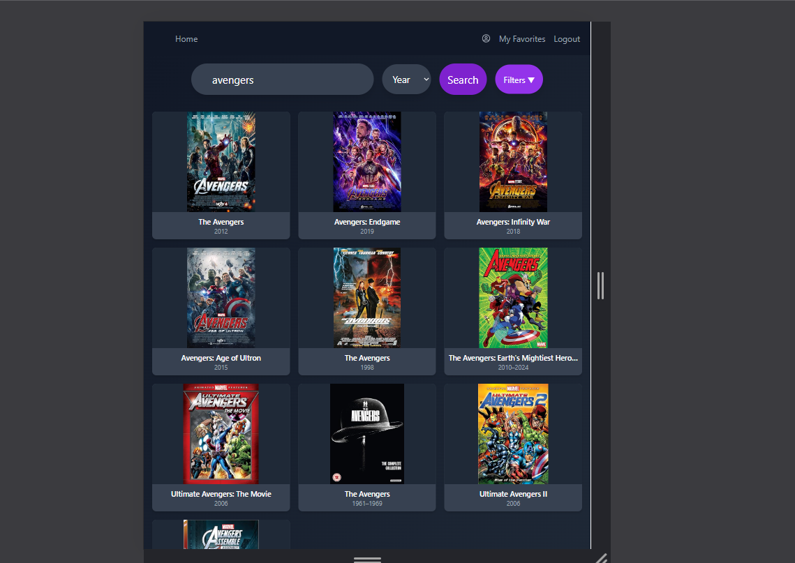

# CineVerse

# Table of Contents
- [Preview](#preview)
- [Introduction](#introduction)
- [Features](#features)
- [Technologies Used](#technologies-used)
- [Setup and Installation](#setup-and-installation)
  - [Prerequisites](#prerequisites)
  - [Steps to Run the Application Locally](#steps-to-run-the-application-locally)

- [Data sources and Assumptions](#sources-and-assumptions)
- [Contributing](#contributing)
- [License](#license)  
- [Acknowledgments](#acknowledgments)
- [Contact](#contact)

## Preview








## Introduction

The **CineVerse** is a dynamic web application that allows users to easily search for movies, view detailed information, manage their list of favorites, and enjoy trailers all in one place. By integrating the OMDb API, it provides real-time data about movies, including their titles, release years, ratings, and much more. Users can add movies to their favorites, view in-depth details, and watch trailers directly within the app, offering a seamless and engaging movie exploration experience.

## Features

- **Search for Movies by Title**: Easily search for movies by entering the title in the search bar.
- **Narrow Down Search Results with Year**: Filter movie listings by year to refine your search results.
- **Play Movie Trailers**: Watch trailers for movies directly from the app.
- **View Detailed Movie Information**: Get comprehensive details about movies including box office collections, ratings, plot summaries, and more.
- **Add/Remove Movies to/from Favorites**: Users can save their favorite movies to their list for easy access later.
- **Responsive Design**: The app is designed to work seamlessly on both mobile and desktop devices for an optimal user experience.
- **Sort Movies by Box Office Collections**:
   High to Low: Sort movies based on their box office collections in descending order.
   Low to High: Sort movies based on their box office collections in ascending order.
- **Sort Movies by IMDb Ratings**:
   High to Low: Sort movies based on IMDb ratings in descending order.
   Low to High: Sort movies based on IMDb ratings in ascending order.
- **Sort Movies by Release Year**:
   New to Old: Sort movies from the latest to the oldest release year.
   Old to New: Sort movies from the oldest to the latest release year.

## Technologies Used

- **Frontend**: React.js
- **API**: OMDb API, Youtube API
- **Libraries**:
  - Axios (for making API requests)
  - React Router (for routing)
  - Firebase (for user authentication and storing favorite movies)
  - Tailwind CSS (for styling)
  - React Icons (for icons like heart and star)

## Setup and Installation

### Prerequisites

Ensure the following are installed on your machine:

- **Node.js** (includes npm) — [Install Node.js](https://nodejs.org/)
- **Firebase account** — [Get started with Firebase](https://firebase.google.com/)
- **OMDbAPI Key** from OMDb API — [Get OMDb API Key](https://www.omdbapi.com/apikey.aspx)
- **Youtube API Key** from Youtube API — [Get Youtube API Key](https://console.cloud.google.com/apis/credentials?inv=1&invt=Abktdw)


### Steps to Run the Application Locally

1. **Clone the Repository**  
   Clone the project to your local machine using:
   ```bash
   git clone https://github.com/papireddy903/Movie-Application-Using-OMDb-API.git
   ```
2. **Navigate to the Project Directory**  
   Change into the project directory:
   ```bash
   cd Movie-Application-Using-OMDb-API
   ```
3. **Install Dependencies**
    Install necessary dependencies
    ```bash
    npm install
    ```
4. **Setup Firebase**
    * Create a Firebase project and enable Firebase Authentication.
    * Obtain the Firebase configuration details from the Firebase console.
    * Refer to the [Firebase Web Setup documentation](https://firebase.google.com/docs/auth/web/start?hl=en&authuser=0) for more details on setting up Firebase Authentication in your web app.
    * Once you have your configuration details, add it to the .env file.

    ```bash
        REACT_APP_FIREBASE_API_KEY="your-firebase-api-key"
        REACT_APP_AUTH_DOMAIN="your-auth-domain"
        REACT_APP_PROJECT_ID="your-project-id"
        REACT_APP_STORAGE_BUCKET="your-storage-bucket"
        REACT_APP_MESSAGING_SENDER_ID="your-sender-id"
        REACT_APP_APP_ID="your-app-id"
        REACT_APP_MEASUREMENT_ID="your-measurement-id"
    ```

5. **Obtain OMDb API KEY**
    - Obtain APIKEY from [here](https://www.omdbapi.com/apikey.aspx)
    Once you have your key, add it to the .env file in the root of your project:
    ```bash
    REACT_APP_OMDB_API_KEY="your-omdb-api-key"
    ```
- Ensure that the .env file is added to your .gitignore to prevent exposing sensitive information.

6. **Obtain Youtube API KEY**
    - Obtain API KEY from [here](https://console.cloud.google.com/apis/credentials?inv=1&invt=Abktdw)
    Once you have your key, add it to the .env file in the root of your project:
    ```bash
    REACT_APP_YOUTUBE_API_KEY="your-youtube-api-key"
    ```
- Ensure that the .env file is added to your .gitignore to prevent exposing sensitive information.

7. **Run the Application**
    Start the app with 
    ```bash
    npm start
    ```
    This will launch the application on http://localhost:3000 in your browser.

## Data sources and Assumptions
   - The app uses the OMDb API to fetch movie data.
   - The app assumes that the OMDb API provides accurate and up-to-date movie information.      
   - The app uses Firebase for user authentication and storing favorite movies.
   - The app uses Tailwind CSS for styling.
   - The app uses React Icons for icons like heart and star.
   - It is assumed that the data fetched from the OMDb API is accurate and up-to-date, as the application relies on this data for displaying movie information.
   - The application assumes that users will have a stable internet connection to interact with the OMDb API for movie data and Firebase for authentication and storage.
   - The application assumes that users will access it using modern web browsers that support the technologies used (e.g., React, Tailwind CSS).
   - It is assumed that the environment variables in the .env file are correctly configured for the application to function properly.
## Contributing
Contributions are welcome! If you have a feature or bug fix you'd like to contribute, please follow the steps below.
   - Fork the repository
   - Create a feature branch
   - Commit your changes
   - Push to the branch
   - Open a pull request    

## License
   This project is licensed under the [MIT License](https://choosealicense.com/licenses/mit/).

## Acknowledgments
   - [React Router](https://reactrouter.com/)
   - [Firebase](https://firebase.google.com/)
   - [Tailwind CSS](https://tailwindcss.com/)
   - [React Icons](https://react-icons.github.io/react-icons/)
   - [OMDb API](https://www.omdbapi.com/)   
   - [Youtube API](https://developers.google.com/youtube/v3/getting-started)

## Contact         
   - Email: [papireddyeppala903@gmail.com](mailto:papireddyeppala903@gmail.com)


